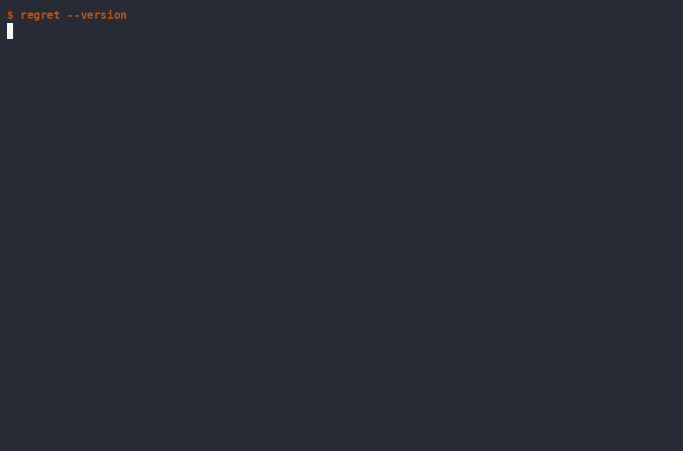
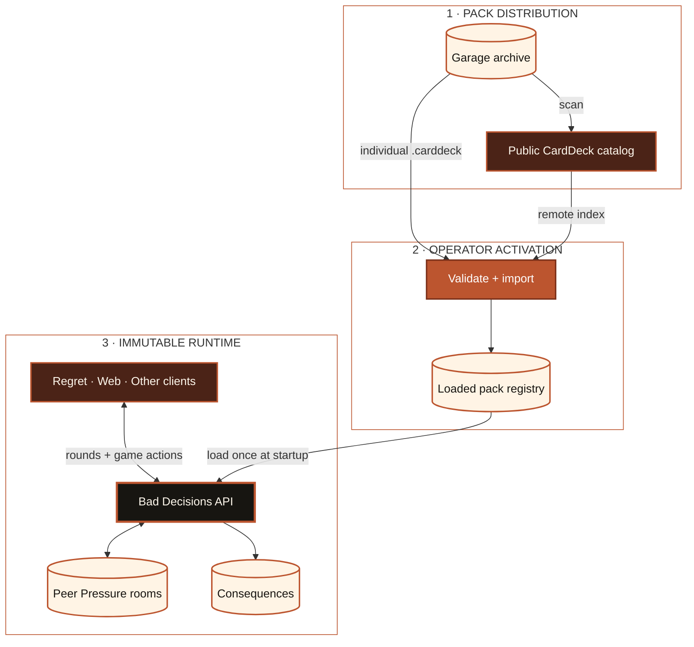

# Bad Decisions

**An absurdly overengineered open-source party game engine.**

[](https://github.com/BytesAndCoffee/bad-decisions/actions/workflows/ci.yml)
[](https://pypi.org/project/bad-decisions/)
[](https://pypi.org/project/bad-decisions-client/)
[](LICENSE)

Bad Decisions serves fill-in-the-blank party games through a REST API, browser
client, and terminal client. Its terminal client is called **Regret**.

```console
$ regret deal --packs coffee
I started by talking about workplace accommodations. Somehow the channel is now discussing one hell of a robustly deployed pastebin.
```

[](docs/DEMO.md)

```bash
brew install bytesandcoffee/tap/regret
regret deal
```

Prefer pipx? `pipx install bad-decisions-client` gets you the same dependency-free
client on Linux, macOS, or Windows. Regret uses the free BytesAndCoffee-hosted
service by default; no account is required.
On Windows, each GitHub release also includes a self-contained `regret.exe`
ZIP with the Peer Pressure TUI and no Python prerequisite.


[Play in the browser](https://bytes.coffee/bad-decisions/web/) ·
[Explore the API](https://bytes.coffee/bad-decisions/docs/) ·
[Get started in 60 seconds](docs/GETTING_STARTED.md)

## Why this exists

Bad Decisions is production-grade infrastructure for profoundly unserious
purposes. The protocol is open, packs are portable and provenance-aware, the
service is self-hostable, multiplayer needs no permanent accounts, and the
overengineering is part of the joke.

## What has gone wrong so far

- **`regret deal`** — get a terrible idea from any compatible service in one command.
- **[Peer Pressure](docs/PEER_PRESSURE.md)** — install-free browser or terminal multiplayer with ephemeral authenticated rooms and a rotating Responsible Adult.
- **[Browser client](https://bytes.coffee/bad-decisions/web/)** — choose packs, deal rounds, and opt into feedback without installing anything.
- **[OpenAPI](https://bytes.coffee/bad-decisions/docs/)** — a versioned contract for building clients that should never have existed.
- **[CardDeck](docs/CARDDECK.md)** — portable, validated `.carddeck` archives with licensing and provenance inside.
- **[Remote catalog](docs/REMOTE_IMPORTS.md)** — discover and safely import public packs without making the runtime mutable.
- **[Provenance](docs/ATTRIBUTION.md)** — card content keeps its own attribution, source, and license boundaries.
- **[Consequences](docs/CONSEQUENCES.md)** — opt-in feedback and owner analytics backed by SQLite.
- **[Self-hosting](docs/EASY_DEPLOY.md)** — systemd/nginx deployment with immutable releases and health-checked rollback.
- **[Rootless updates](docs/DEPLOYMENT.md#rootless-application-updates)** — deploy and roll back application releases without recurring sudo.
- **[AWS-native mode](docs/DEPLOYMENT.md#aws-native-deployment)** — a complete managed-cloud alternative optimized for low cost.

## How the bad decisions travel



Public `.carddeck` archives and their generated catalog are distribution
inputs, not a writable runtime API. An operator explicitly imports and
validates packs into the registry; the server loads that registry at startup
and then treats it as immutable. Clients consume rounds and pack metadata—or
participate in Peer Pressure—while room state and opt-in Consequences data stay
in separate SQLite boundaries.

## Sixty-second quick start

```bash
brew install bytesandcoffee/tap/regret
regret health
regret deal
```

Cross-platform alternative:

```bash
pipx install bad-decisions-client
regret health
regret deal
```

Both pipx packages install manual pages; `regret doctor` diagnoses PATH,
manual-page, preference, and service issues without changing anything.

Invite friends into an ephemeral Peer Pressure room:

```bash
regret together ohno --name Michael
```

Or use the hosted [browser table](https://bytes.coffee/bad-decisions/peerpressure)
with no installation.

The default endpoint is `https://bytes.coffee/bad-decisions`. Override it with
`--api-url`; local preferences live in protected files under your home
directory. See [Getting Started](docs/GETTING_STARTED.md) for the complete short
path and privacy controls.

## Build something stupid with it

The OpenAPI contract is intended to be enough to build another client. Please
make an ESP32 button, e-ink daily draw, IRC bot, Discord bot, smartwatch app,
desktop widget, or a frontend with even more regrettable typography.

```bash
curl -s https://bytes.coffee/bad-decisions/v2/round \
  | python3 -c 'import json,sys; print(json.load(sys.stdin)["result"])'
```

```python
import json
from urllib.request import urlopen

with urlopen("https://bytes.coffee/bad-decisions/v2/round") as response:
    print(json.load(response)["result"])
```

Start with the [live OpenAPI UI](https://bytes.coffee/bad-decisions/docs/) and
the [version-2 API notes](docs/MIGRATING-2.0.md). If you build something, the
maintainer would very much like to see what happened.

## Make your own pack

The [minimal-pack example](examples/minimal-pack/) goes from editable JSON to a
validated `.carddeck` in about five minutes:

```bash
cp -R examples/minimal-pack /tmp/my-questionable-pack
cd /tmp/my-questionable-pack
./build.sh
bad-decisions pack validate dist/example-pack.carddeck
```

CardDeck archives contain exact license and attribution documents alongside
the cards. Read the [CardDeck specification](docs/CARDDECK.md) before sharing a
pack, and only distribute content you have the right to distribute.

## Run the engine

```bash
pipx install bad-decisions
bad-decisions --oneshot
bad-decisions serve --host 127.0.0.1 --port 8000
```

The API exposes `/healthz`, `/v2/packs`, `/v2/round`, Peer Pressure, and optional
Consequences feedback. Packs are loaded at startup; the HTTP API cannot import,
upload, or edit them. An omitted pack selector means every loaded pack.

For a production install, start with [Easy Deploy](docs/EASY_DEPLOY.md). The
[full deployment reference](docs/DEPLOYMENT.md) covers systemd/nginx, rootless
activation, AWS-native mode, object storage, configuration, and rollback.

## Licensing is deliberately less funny

Bad Decisions software is licensed under the [MIT License](LICENSE). Card packs
are separate works: each pack's own license, attribution, provenance, and
modification metadata governs that content. The software's MIT license grants
no additional rights to third-party cards, and BytesAndCoffee cannot grant
rights it does not own.

The official BytesAndCoffee distribution and hosted service are currently free
of charge, with no paid API access, sale of access, or advertising. That is a
description of the official service, not a restriction on downstream use of
the MIT-licensed software.

In other words: use the engine however MIT permits, but check the license on
the cards you put into it. If your Bad Decisions have Consequences, that is
between you and the stew.

## Go deeper

- [Documentation map](docs/README.md)
- [Installing and using Regret](client/README.md)
- [CardDeck format](docs/CARDDECK.md) and [remote imports](docs/REMOTE_IMPORTS.md)
- [Peer Pressure](docs/PEER_PRESSURE.md) and [Consequences](docs/CONSEQUENCES.md)
- [Attribution and content rights](docs/ATTRIBUTION.md)
- [Deployment](docs/DEPLOYMENT.md) and [release process](docs/RELEASING.md)
- [Contributing](CONTRIBUTING.md), [security](SECURITY.md), and [changelog](CHANGELOG.md)
- Manual pages: [bad-decisions(1)](man/bad-decisions.1) and [regret(1)](client/man/regret.1)

If this terrible decision amused you, consider starring the repository.

This is an unofficial, unaffiliated fan project. No endorsement by any
third-party game publisher is claimed or implied.
